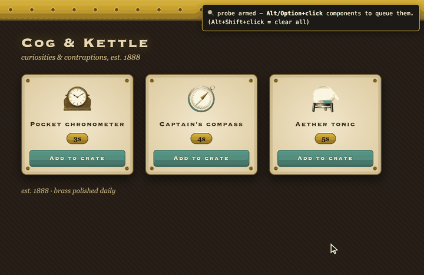

# click-to-edit-ui

A [Claude Code](https://claude.com/claude-code) plugin that lets you **point at web UI components instead of describing them**.



Editing a rendered UI with an agent is slow when you have to explain what you mean in words — *"the third dot in the second row of the sidebar…"*. With this skill, Claude injects a small probe into the page open in your browser; you **Alt-click** the components you want changed, each click gets a numbered badge (1, 2, 3…), and you request edits by number:

> "Make **1** bigger, hide **2**, change **3** to green."

Claude reads the ordered selection back from the page (`window.__probe.list()`), maps each element to its source, edits the code, reloads the page, and re-arms the probe — so the click → edit → verify loop never breaks.

## How it works

- **Alt/Option + click** — queue a component (badge pinned on it + listed in a top-right HUD)
- **Alt + hover** — dashed outline preview of what would be selected
- **Alt + Shift + click** — clear the queue
- **Drag the ⠿ grip** — move the HUD anywhere it's out of your way (double-click the grip to reset it, **−** to collapse it to its title bar)
- Normal clicks are untouched, so the page stays fully usable

The probe is registered as a navigation init-script, so it survives page reloads — including your own Cmd+R. The HUD's position and collapsed state persist across those reloads too, for as long as the tab stays open.

## Requirements

A [chrome-devtools MCP](https://github.com/ChromeDevTools/chrome-devtools-mcp) connection (the skill uses its `navigate_page` and `evaluate_script` tools).

## Install

```
/plugin marketplace add hyemin-ht-kang/click-to-edit-ui
/plugin install click-to-edit-ui@click-to-edit-ui
```

## Usage

1. Open your dev server or a local HTML file in the chrome-devtools browser.
2. Ask Claude: *"set up the click probe"* (or just start Alt-clicking after any UI editing session begins).
3. Alt-click the components you want changed, then request edits by number.

## License

[MIT](LICENSE)
